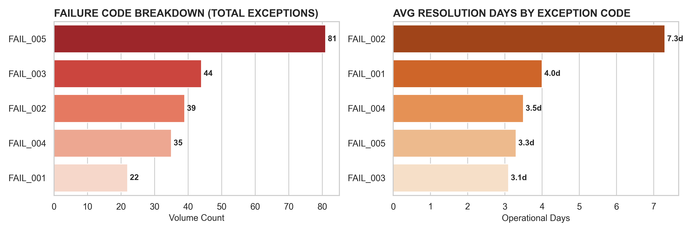
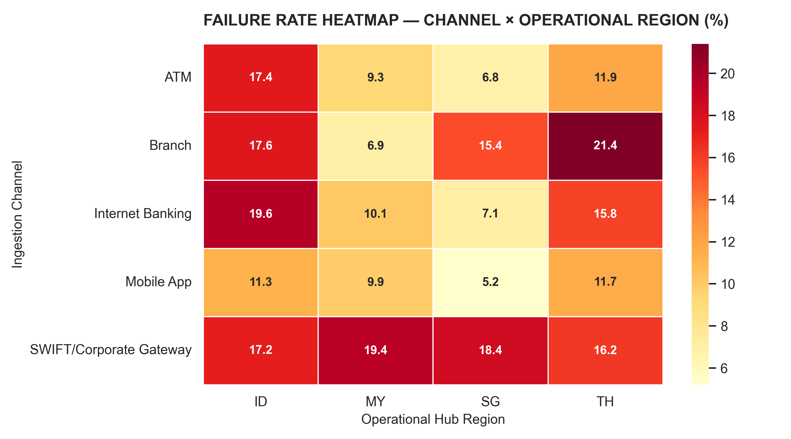

# CASE STUDY: APAC Banking Operations Straight-Through Processing (STP) Optimization
**Author:** Chelsea Pang Kiat Si  

---

## 1. Executive Summary & Strategic Problem Statement

### Strategic Context
In high-volume regional banking hubs, operational excellence hinges on the continuous optimization of **Straight-Through Processing (STP) rates**. Any deviation from automated processing paths forces transactions into manual exception queues. This introduces systemic liquidity friction, increases operating costs under Basel risk frameworks, and impairs the customer experience for high-net-worth (HNW) and corporate clients.

### The Operational Problem
This case study evaluates a core transaction processing network handling settlement across major APAC books (**Singapore, Malaysia, Thailand, and Indonesia**). Comprehensive diagnostics reveal that the infrastructure operates at an aggregate transaction failure rate of **11.1%** (221 failed transactions out of a 2,000 baseline volume), resulting in an aggregate STP rate of **88.9%**. This falls short of the target **95.0% institutional efficiency benchmark**. 

Crucially, **18.1% of these exceptions are currently stalled in "Pending Escalation" states**, binding up high-value corporate liquidity and overwhelming regional clearing desks. This report dissects the technical and geographical root causes of these process leaks and presents a structured digital transformation roadmap to recover automated capacity.

---

## 2. Technical Methodology & Synthetic Data Engineering

To perform this diagnostic analysis without exposing sensitive, proprietary institutional customer records, a complete, production-grade relational database was engineered from scratch. This demonstrates structural data modeling proficiency, pipeline construction, and localized domain knowledge.

### Data Synthesis via Python `Faker`
Using the **`generate_data.py`** engine, a synthetic data pipeline was built to generate a 2,000-transaction ledger. Rather than utilizing basic random values, the script leverages Python’s **`Faker`** library to inject realistic banking parameters alongside intentional, highly structured operational vulnerabilities:

1. **Localized Geographies & Currency Routing:** The engine maps transactions across four key ASEAN jurisdictions (**SG, MY, TH, ID**), automatically matching transactions with realistic regional currencies (SGD, MYR, THB, IDR).
2. **Channel-Based Ingestion Mapping:** Transactions are routed across varying legacy and digital endpoints: *Mobile App, Internet Banking, Branch, ATM, and the SWIFT/Corporate Gateway*.
3. **Structured Anomalies & Conditional Dropouts:** To mimic genuine system vulnerabilities, conditional business rules were written directly into the simulation:
   * **The FX Rate Expiry Trap (`FAIL_005`):** An intentional time-lag simulation was coded to ensure that transactions with longer internal compliance clearance windows (disproportionately affecting high-value transfers) trigger an expired exchange rate card flag.
   * **SWIFT File Misalignments:** Structural data field truncation noise was injected into bulk corporate B2B file streams to simulate leg-one validation failures.
   * **Regional Maturity Spreads:** The data generator was calibrated to inject higher failure coefficients into developing market hubs (Indonesia and Thailand) to capture real-world infrastructure disparities.

The finalized dataset was compiled and written into a local SQLite asset (**`banking_ops.db`**), creating a robust, verifiable relational ledger for the downstream analytical engine.

---

## 3. Advanced Relational Diagnostics & Analytical Findings

Executing advanced conditional aggregations and multi-dimensional cross-tabulations against the database ledger surfaces four critical system vulnerabilities:

### A. The High-Value Validation Trap: `FAIL_005` (FX Rate Expiry)
* **The Quantitative Trend:** `FAIL_005` represents the single most severe operational bottleneck, accounting for **81 separate failures** (37% of the total exception pool). 
* **The Strategic Risk:** Granular segmentation reveals that **87% of these failures occur in our top-25% highest transaction value band (exceeding SGD 114,000)**. This proves the issue is concentrated within our premier client tier.
* **Root-Cause Analysis:** Large-value transactions face strict internal compliance, anti-money laundering (AML), and dual-authorization holds. Because these workflows lack automation, the underlying currency FX rate cards lock out and expire before final ledger execution, trapping high-value institutional liquidity.

### B. Channel Ingestion Vulnerabilities: The SWIFT Corporate Bottleneck
* **The Quantitative Trend:** The **SWIFT/Corporate Gateway** exhibits an alarming **18.1% failure rate**—which is **2.3x higher** than consumer-facing digital channels like the Mobile App (8.6%).
* **Product Line Intersection:** Dimensional cross-tabulation heatmaps reveal that SWIFT failure points are heavily concentrated within **Current Account Savings Accounts (CASA) at 26.7%** and **Foreign Exchange (FX) lines at 24.1%**.
* **Root-Cause Analysis:** This severe leakage signals systematic data field structure mismatches and a total lack of pre-ingestion field validation during automated bulk file transmissions from external B2B clients.

### C. Geographic Infrastructure Imbalance (ASEAN Performance Gap)
* **The Quantitative Trend:** **Indonesia (15.5%)** and **Thailand (14.2%)** exhibit transaction failure rates nearly **double** that of **Singapore (7.8%)**, despite processing lower relative daily volumes.
* **Root-Cause Analysis:** Because this performance gap persists uniformly across all banking product lines (CASA, FX, Loans, Payments), it represents a structural core-banking infrastructure maturity gap across regional networks rather than an isolated application glitch.

### D. Operational Tail Risk: Trapped Escalation Liquidity
* **The Quantitative Trend:** Active transactions stuck in **Pending Escalation** hold an average value of **SGD 139,313**, compared to an average value of **SGD 82,683** for cases resolved at the desk level.
* **Strategic Impact:** Backlogs are disproportionately stalling our most critical corporate relationships, increasing counterparty risk and capital friction during market-close windows.

---

## 4. Visualized Operational Performance Dashboard

The analytical visuals are built directly via Python's `seaborn` and `matplotlib` libraries, translating the database ledger into management-ready dashboard modules:

### A. Core Vulnerability Profile & Resolution Latencies
This module isolates the raw volumetric count of specific error codes against the average business days required for operations desks to manually investigate and resolve them. It highlights that while `FAIL_005` dominates volume, compliance-based screening holds (`FAIL_002`) drive the longest manual resolution tail (**7.3 days**):

### B. Multi-Dimensional Failure Heatmap Matrix
This matrix cross-tabulates failure rates across ingestion channels and geographic hubs, isolating the operational vulnerabilities within the Indonesian SWIFT gateway:

*Detailed SQL cells, structural pivot parameters, and execution blocks can be reviewed inside the [Interactive Case Study Notebook](./APAC_Banking_Ops_Analysis.ipynb).*

---

## 5. Quantitative Financial & Operational Business Impact Matrix

When an operational process breaks down, the financial and structural cost compounds across multiple balance sheet and business dimensions:

### A. Core Liquidity Drag & Opportunity Cost
* **The Exposure:** With an average transaction value of **SGD 139,313** trapped in Pending Escalation states across roughly **40 separate accounts** simultaneously, the processing bottleneck routinely binds up approximately **SGD 5.5 Million in active operational float** daily.
* **The Financial Impact:** In a high-interest-rate environment, trapping capital in non-earning investigative clearing accounts creates a direct drag on net interest margins (NIM). Clearing this pipeline structural defect releases immediate liquidity that can be instantly deployed into active high-yield interbank lending or corporate treasury facilities.

### B. FTE Capacity & Operational Overhead Scarcity
* **The Resource Drain:** Processing 221 exceptions manually requires an estimated **25 to 45 minutes per transaction** for an operational specialist to trace SWIFT messages, verify FX card histories, and contact regional settlement desks.
* **The Overhead Multiplier:** This drains roughly **110 to 160 operational staff hours per monthly cycle** purely on corrective maintenance. By shifting from reactive clearing to proactive API validation, we pivot expensive human capital away from repetitive entry tasks and toward high-value corporate account management and relationship retention.

### C. Counterparty Settlement Risk & SLA Penalties
* **The Compliance Friction:** Compliance-based holds (`FAIL_002`) trigger a severe **7.3-day processing tail**. 
* **The Contractual Breach:** For high-volume enterprise clients, delayed cross-border payments directly violate strict Service Level Agreements (SLAs), triggering automated financial penalties, damaging institutional trust, and exposing the bank to capital volatility during the multi-day settlement window.

---

## 6. Target Digital Transformation Strategy & Execution Lifecycle

To eliminate the automation deficit, move towards a 95% baseline, and release trapped transactional liquidity, this case study proposes a three-phased deployment roadmap:

### Phase 1: Ingestion Standardization (Short-Term | Days 1 - 90)
* **Strategic Target:** Address the **SWIFT Corporate Gateway Bottleneck** (CASA 26.7% / FX 24.1% failure rates).
* **Execution:** Deploy lightweight data parsing microservices at the organizational perimeter. These services intercept bulk B2B file payloads and instantly reject or flag improperly formatted records *prior* to internal ledger entry.
* **KPI Success Metric:** Drive SWIFT gateway processing dropouts down by **50% within the first quarter of deployment**.

### Phase 2: High-Value Pricing Automation (Medium-Term | Days 90 - 180)
* **Strategic Target:** Eliminate **`FAIL_005` (FX Rate Expiry)** on transactions exceeding SGD 114,000.
* **Execution:** Configure a dedicated Robotic Process Automation (RPA) workflow or high-frequency API bridge connecting the regional compliance engine directly to the active treasury pricing desk. If an internal authorization hold exceeds a pre-set timeout window, the system automatically pulls a fresh rate card or applies an institutional short-term buffer.
* **KPI Success Metric:** Achieve **zero high-value transaction drops** due to currency card expiration across all major ASEAN books.

### Phase 3: Cognitive Triage & Exception Routing (Long-Term | Day 180+)
* **Strategic Target:** Alleviate the **7.3-day investigative tail** tied to compliance anomalies (`FAIL_002`).
* **Execution:** Introduce a machine learning text-classifier to ingest unstructured audit trail text fields from historical exception files. The algorithm automatically filters and routes clear false-positives while escalating genuine high-risk files to senior compliance officers instantly.
* **KPI Success Metric:** Compress average operational resolution latency from **7.3 days down to less than 24 hours**.
EOF
echo "✅ README.md file successfully updated with Business Impact and Strategy!"
